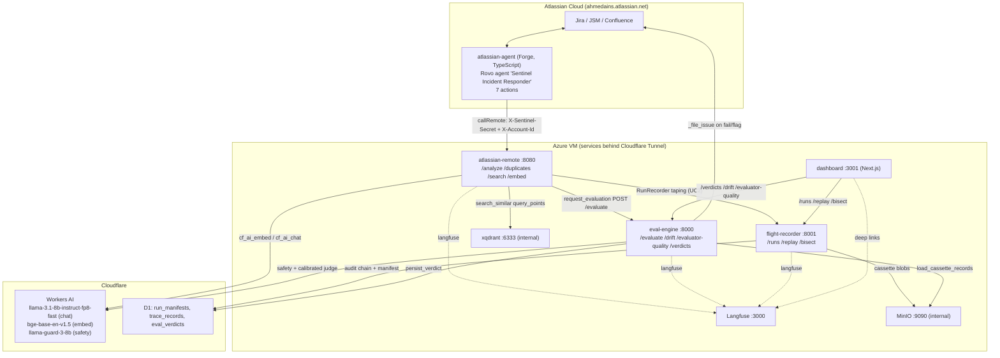
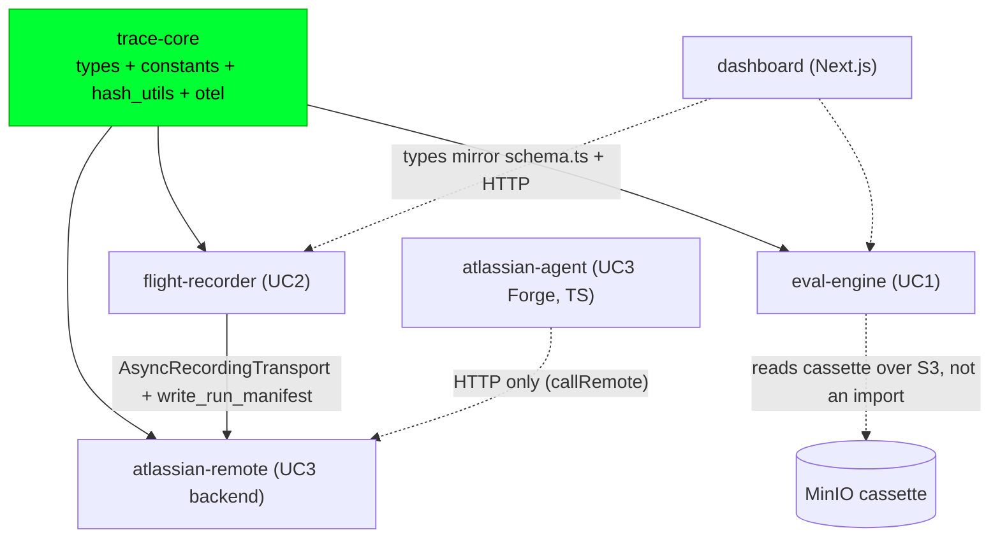
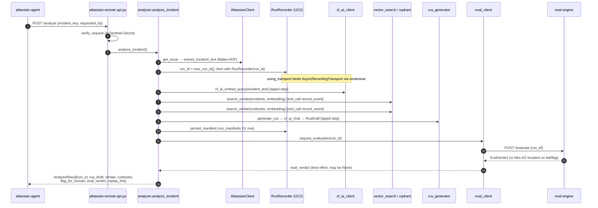
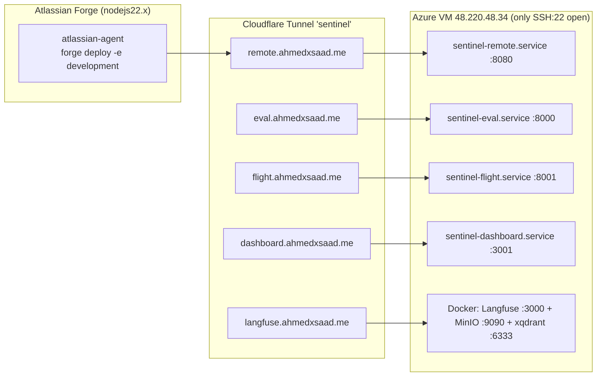

# Sentinel — System Diagrams

> Diagrams derived from the actual source (not just the docs). Every fenced
> ` ```mermaid ` block below is a **standalone** diagram: copy the lines between the
> fences and paste them straight into the [Mermaid Live Editor](https://mermaid.live).
>
> Per-component internals each have their own `DIAGRAM.md`:
> [trace-core](packages/trace-core/DIAGRAM.md) ·
> [flight-recorder](packages/flight-recorder/DIAGRAM.md) ·
> [eval-engine](packages/eval-engine/DIAGRAM.md) ·
> [atlassian-remote](packages/atlassian-remote/DIAGRAM.md) ·
> [atlassian-agent](packages/atlassian-agent/DIAGRAM.md) ·
> [dashboard](packages/dashboard/DIAGRAM.md) ·
> [deploy](deploy/DIAGRAM.md) ·
> [infra](infra/DIAGRAM.md)

---

## 1. High-level system (the three use cases as one loop)



---

## 2. Package dependency graph (enforced, no cycles)



---

## 3. End-to-end data flow: `POST /analyze` → recorded + judged verdict



---

## 4. Deployment topology


