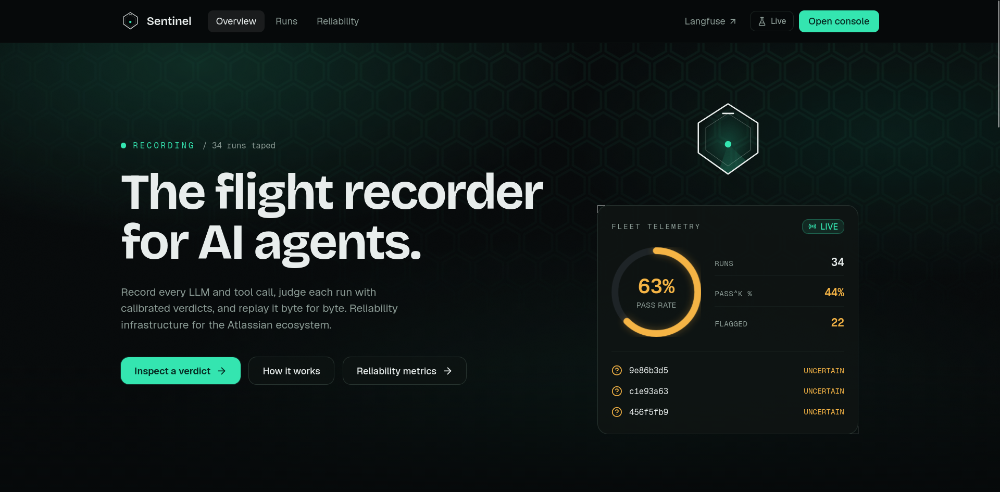
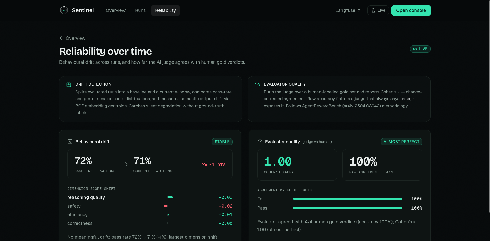
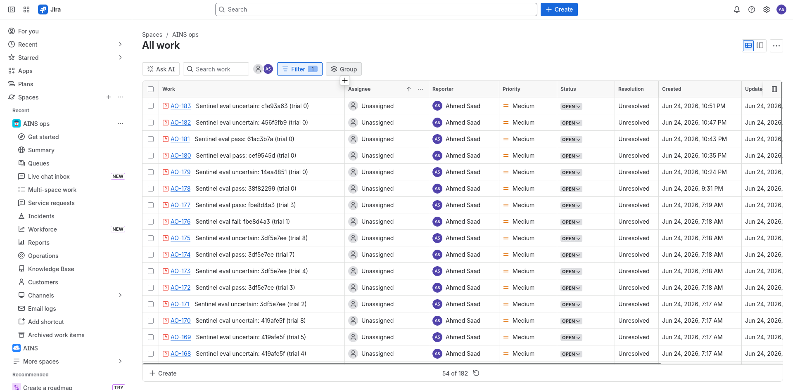
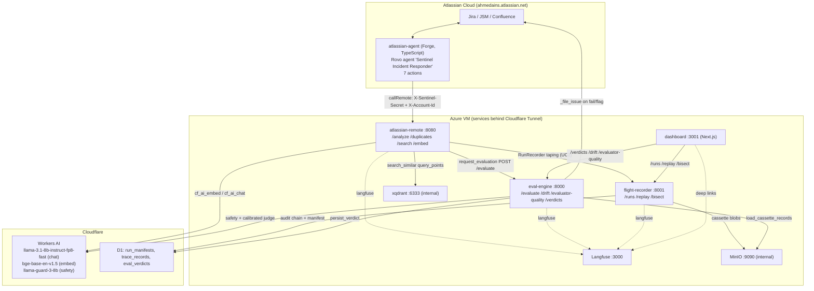
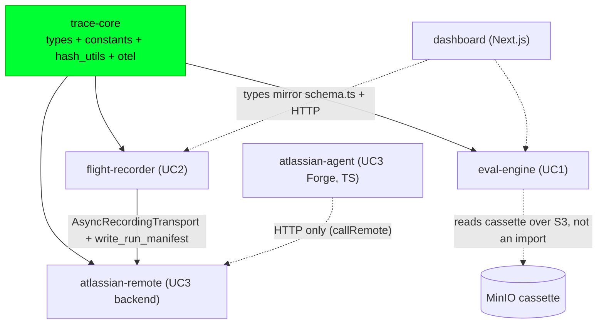
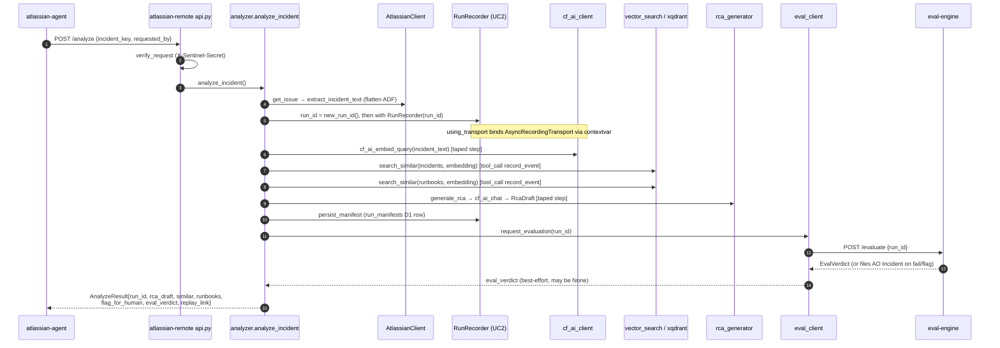
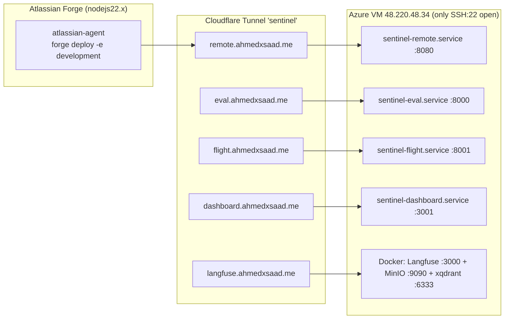

<div align="center">

# 🛰️ Sentinel

### The reliability layer for enterprise AI agents.

**Record every run · Replay it deterministically · Evaluate the trajectory · File an auditable verdict back into Jira — continuously.**

`AINS Hackathon 2026` · in partnership with [Vectors](https://covectors.io) · *AI for Enterprise Automation*


[Architecture](docs/ARCHITECTURE.md) · [Eval Report](docs/eval_report.md) · [Scalability & Reliability](docs/scalability_reliability.md) · [How It Works](docs/how_it_works.md) · [Open-Contribution Specs](spec/)

</div>

---

<div align="center">



<sub>**The dashboard** — flight-recorder home with live pass-rate telemetry and recent verdicts · `dashboard.ahmedxsaad.me`</sub>

</div>

---

## The problem

Enterprises are shipping AI agents that **fail silently**. The same instruction, given twice, produces different tool calls and different outputs — so traditional unit tests, which match exact output, are structurally incompatible. An agent can look busy, reason intelligently, call the right‑*looking* tools, and still corrupt a Jira ticket, overwrite a Confluence page, or mis‑route a JSM workflow. **The failure only becomes visible after the side effect — when the damage is already done.**

There is no infrastructure today that captures the full execution trajectory of an agent run, evaluates it, attributes failure to a specific component, and does it *continuously* on every production run.

## The solution — one platform, three jobs, one loop

Sentinel is that infrastructure. It unifies **all three hackathon use cases into a single self‑reinforcing system** — and we dogfooded it on a real Rovo agent we deployed to Atlassian.

```
        ┌──────────────────────────────────────────────────────────────┐
        │                                                              │
        ▼                                                              │
  ┌───────────┐     ┌────────────────┐     ┌─────────────┐     ┌──────────────┐
  │   UC3     │     │     UC2        │     │    UC1      │     │   Verdict    │
  │ Rovo Agent│ ──► │ Flight Recorder│ ──► │ Eval Engine │ ──► │ → Jira issue │
  │ (Forge)   │     │ record + replay│     │ judge + RCA │     │ + Dashboard  │
  └───────────┘     └────────────────┘     └─────────────┘     └──────────────┘
   acts in Jira      taped, hash-chained     failure attribution,   the loop
   & Confluence      deterministic replay    pass^k, drift, κ       closes
```

> **Remove the AI and the system ceases to exist.** Its entire job is evaluating, replaying, and reasoning over *non‑deterministic* AI. There is no degraded non‑AI version — the intelligence is the mechanism.

| | Use Case | Package | What it does |
|---|---|---|---|
| **UC2** | Agent Execution Tracer & **Deterministic Replay** | [`flight-recorder`](packages/flight-recorder) | Transparently intercepts every LLM + tool call (httpx transport override), tapes it into a cassette with a **hash‑chained HMAC audit trail**, and replays it **with 0 live API calls** — plus mid‑replay divergence injection. |
| **UC1** | **Continuous Evaluation** of non‑deterministic agents | [`eval-engine`](packages/eval-engine) | Multi‑level grading (deterministic code grader + Llama‑Guard safety + calibrated LLM‑as‑judge), **DAG failure attribution to the exact step**, `pass^k` reliability, **drift detection**, and **evaluator‑of‑evaluator** (Cohen's κ). Files a Jira Incident on a flagged verdict. |
| **UC3** | AI Automation for the **Atlassian Workspace** | [`atlassian-agent`](packages/atlassian-agent) + [`atlassian-remote`](packages/atlassian-remote) | A real **Rovo Agent on Forge** (installed on Jira **and** Confluence): incident RCA + **semantic duplicate resolver** over vector search. Structured output into Jira, never chat. Low confidence → **flags a human, never auto‑acts**. |

The three layers share one [OpenTelemetry GenAI](https://opentelemetry.io/docs/specs/semconv/gen-ai/) trace spine: **UC3 produces the runs, UC2 records them, UC1 judges them, and the verdict lands back in Jira.**

---

## Proof it works (measured, not claimed)

| Dimension | Evidence |
|---|---|
| **Reliability metric** | `pass@1` **100%** / `pass^8` **33.3%** — the τ‑bench‑style consistency gap that pass@1 alone hides ([eval report](docs/eval_report.md)) |
| **Evaluator quality** | **Cohen's κ** (chance‑corrected judge‑vs‑human agreement) — so a constant "pass" judge scores ~0, not a flattering accuracy |
| **Deterministic replay** | Replays a full run with **0 live LLM calls** — guarantees reproducible debugging *and* a deterministic demo |
| **Scales horizontally** | **KEDA** autoscales the eval engine **1 → 5** on CPU; **k6 load test: 153,833 requests, 1,282 req/s, p95 190 ms, 0% errors @ 200 concurrent users** ([details](docs/scalability_reliability.md)) |
| **Survives chaos** | 5 pods killed mid‑traffic → **100% availability, zero downtime**, automatic self‑healing |
| **Engineering rigour** | **167 Python tests** green; `mypy --strict` + `ruff` clean; Helm lint clean |

<div align="center">



<sub>**Reliability over time** — behavioural drift across run windows, and judge-vs-human agreement as chance-corrected **Cohen's κ** (not flattering raw accuracy).</sub>

</div>

---

## Live system

The full stack runs on an Azure VM behind a Cloudflare Tunnel; the Forge app is deployed to a live Atlassian site.

| Service | URL |
|---|---|
| Dashboard (traces · verdicts · replay) | `https://dashboard.ahmedxsaad.me` |
| Eval Engine API (UC1) | `https://eval.ahmedxsaad.me` |
| Flight Recorder API (UC2) | `https://flight.ahmedxsaad.me` |
| Forge Remote backend (UC3) | `https://remote.ahmedxsaad.me` |
| Langfuse (LLM trace UI) | `https://langfuse.ahmedxsaad.me` |
| Rovo Agent | installed on Jira **+** Confluence at `ahmedains.atlassian.net` |

> Public hostnames sit behind Cloudflare's bot challenge — browsers pass, `curl` gets a `403` (expected, not an outage).

<div align="center">



<sub>**The loop closes in Jira** — every evaluated run is filed back as an auditable AO incident with its verdict, so reliability lives where the team already works.</sub>

</div>

---

## Architecture

```
ATLASSIAN CLOUD                          AZURE VM (Cloudflare Tunnel)              CLOUDFLARE
┌────────────────────┐   Forge Remote   ┌──────────────────────────────┐         ┌────────────────┐
│ atlassian-agent    │ ───────────────► │ atlassian-remote  (FastAPI)  │ ──────► │ Workers AI     │
│ Rovo Agent + 7     │      HTTPS       │ /analyze /duplicates /search │  embed  │ Llama 3.1 8B   │
│ Forge Actions (TS) │ ◄─────────────── │   │ records via UC2          │  +RCA   │ Llama Guard 3  │
└────────────────────┘   verdict/issue  │   ▼                          │  +judge │ BGE embeddings │
                                        │ flight-recorder (UC2)        │         └────────────────┘
                                        │   tape → MinIO cassette      │         ┌────────────────┐
                                        │   hash-chain audit → D1      │ ──────► │ D1 (traces)    │
                                        │   ▼                          │         │ Vectorize      │
                                        │ eval-engine (UC1)            │         └────────────────┘
                                        │   judge → verdict → Jira     │   xqdrant (vector search)
                                        │ dashboard (Next.js)          │   MinIO (cassettes)
                                        └──────────────────────────────┘   Langfuse (LLM traces)
```

Full diagram + data flow: **[docs/ARCHITECTURE.md](docs/ARCHITECTURE.md)**.

**Stack:** Cloudflare Workers AI (Llama 3.1‑8B judge, Llama Guard, BGE‑768) · Forge TS SDK · FastAPI · Next.js 16 · xqdrant (Qdrant fork) · MinIO · Cloudflare D1 · Kubernetes + KEDA + Prometheus/Grafana · Langfuse.

---

## Mermaid diagrams

> Paste any block into [mermaid.live](https://mermaid.live) to render it. Per-package internals: [trace-core](packages/trace-core/DIAGRAM.md) · [flight-recorder](packages/flight-recorder/DIAGRAM.md) · [eval-engine](packages/eval-engine/DIAGRAM.md) · [atlassian-remote](packages/atlassian-remote/DIAGRAM.md) · [atlassian-agent](packages/atlassian-agent/DIAGRAM.md) · [dashboard](packages/dashboard/DIAGRAM.md) · [deploy](deploy/DIAGRAM.md)

### 1. High-level system (the three use cases as one loop)



### 2. Package dependency graph (enforced, no cycles)



### 3. End-to-end data flow: `POST /analyze` → recorded + judged verdict



### 4. Deployment topology



---

## Quick start

```bash
git clone https://github.com/ahmedxsaad/AINS.git && cd AINS
make setup          # install all deps (Python uv workspace + Node)
make env            # create .env from .env.example, then fill it in
make seed           # seed the Atlassian dev site with synthetic incidents + runbooks
make seed-xqdrant   # embed them into xqdrant (required for retrieval)
make dev            # start the services locally
make test           # run all tests (167 Python + TS jest)
make check          # lint + typecheck + docs parity (run before every commit)
```

### Deploy on Kubernetes (scalability + observability + chaos)

```bash
# Minikube + KEDA autoscaling, Prometheus/Grafana, chaos experiments — all under deploy/
kubectl apply -k deploy/k8s                                   # the stack in its own `sentinel` namespace
kubectl apply -f deploy/k8s/keda/                             # KEDA ScaledObject (1→5 on CPU)
kubectl apply -f deploy/k8s/load/k6/k6-job.yaml               # measured load test
bash deploy/chaos/pod-kill.sh && bash deploy/chaos/steady-state.sh   # prove self-healing
```

See **[deploy/README.md](deploy/README.md)**, **[deploy/observability/](deploy/observability/)**, and **[deploy/chaos/](deploy/chaos/)**.

---

## Repo structure

```
AINS/
├── packages/
│   ├── trace-core/        Shared OTel GenAI schema + types (the contract all packages import)
│   ├── flight-recorder/   UC2 · record / replay / bisect / divergence-inject (Python)
│   ├── eval-engine/       UC1 · graders, calibrated judge, attribution, pass^k, drift, κ (Python)
│   ├── atlassian-agent/   UC3 · Forge Rovo Agent + 7 actions (TypeScript)
│   ├── atlassian-remote/  UC3 · heavy-compute backend: embeddings, vector search, RCA (Python)
│   └── dashboard/         Unified UI · traces, verdicts, replay, divergence editing (Next.js)
├── deploy/                Kubernetes + KEDA + Helm + observability + chaos
├── interpretability/      Offline embedding interpretability pipeline (vocab → geometry → attribution)
├── infra/                 Cloudflare (D1/Vectorize/Tunnel) + Azure VM provisioning
├── scripts/               Data seeding + synthetic eval runs
├── spec/                  Protocol-gap proposals — our open contribution (bonus)
├── docs/                  Architecture, eval report, scalability/reliability, how-it-works
└── tests/                 Cross-package end-to-end integration tests
```

---

## How we score against the brief

- **AI is the mechanism, not a feature** — remove the LLM judge / embeddings / RCA and there is no evaluation, no semantic dedup, no attribution. Chained prompts + structured extraction + DAG attribution, *not* input→LLM→paste.
- **Explainability & auditability** — every verdict says *what the agent should have done, what it did, where it diverged, and the recommended action*, with confidence, retrieval evidence, and a tamper‑evident audit chain.
- **Evaluation & rigour** — a real protocol on a synthetic test set; non‑determinism handled via position‑bias calibration, `pass^k`, and Cohen's κ.
- **Bonus points claimed** — **protocol gap documented** ([OTel GenAI replay extension](spec/otel-genai-replay-extension.md), [MCP audit‑trail proposal](spec/mcp-audit-trail-proposal.md)) · **self‑evaluation** (confidence + flag‑for‑human) · **open contribution** (the spec/ artifacts).

---

## Team

Team **Selecao** — AINS Hackathon 2026

| Member | Focus |
|---|---|
| **Ahmed Saad** ([@ahmedxsaad](https://github.com/ahmedxsaad)) | UC2 Flight Recorder · integration loop · dashboard · infra |
| **Ahmed Ben Rejeb** | UC1 drift + evaluator‑quality · UC3 semantic duplicate resolver · K8s/KEDA scalability |
| **Moetez Fradi** | UC3 Forge Rovo Agent · Atlassian integration |

---

## Key references

| Doc | What's in it |
|---|---|
| [docs/ARCHITECTURE.md](docs/ARCHITECTURE.md) | System components, data flow, AI pipeline |
| [docs/how_it_works.md](docs/how_it_works.md) | The end‑to‑end loop, explained |
| [docs/eval_report.md](docs/eval_report.md) | Metrics, protocol, results (`pass^k`, κ, drift) |
| [docs/scalability_reliability.md](docs/scalability_reliability.md) | KEDA / k6 / chaos numbers + design facts |
| [docs/spec_response.md](docs/spec_response.md) | Point‑by‑point answer to every acceptance criterion |
| [docs/TECHNICAL_SPECS.md](docs/TECHNICAL_SPECS.md) · [docs/BATTLE_PLAN.md](docs/BATTLE_PLAN.md) | Full technical spec + build plan |
| [spec/](spec/) | Open‑contribution protocol proposals |
