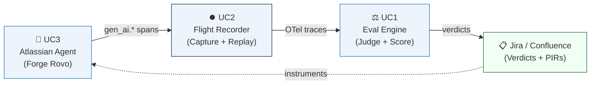

<div align="center">

# 🛡️ Sentinel

### AI Agent Reliability Platform for the Atlassian Ecosystem

*Continuous evaluation · Deterministic replay · Intelligent incident response*

[](https://github.com/FantazyTV/Sentinel)
[](https://covectors.io)
[](https://python.org)
[](https://typescriptlang.org)
[](https://anthropic.com)
[](LICENSE)

**Team Selecao** · Ahmed Saad · Moetez Fradi · Ahmed Ben Rejeb

[Live Demo](https://ains.ahmedxsaad.me) · [Concept Presentation](docs/CONCEPT_PRESENTATION.pdf) · [Architecture](docs/ARCHITECTURE.md) · [Battle Plan](docs/BATTLE_PLAN.md)

</div>

---

## The Problem

Enterprise teams deploying AI agents in Atlassian workflows face three production problems that no existing tooling solves:

| Problem | Consequence |
|---|---|
| **Silent failures** | An agent completes all tool calls without error, yet produces the wrong Jira assignment, wrong severity, wrong Confluence page — no alert fires |
| **Invisible inconsistency** | An agent that works 60% of the time looks identical to one that works 100% of the time in conventional monitoring |
| **Unreproducible failures** | Re-running a failed agent produces different behavior; side-effecting tools (Jira comments, emails) fire again during debugging |

> **Remove the AI component and the system ceases to function entirely.** The intelligence is the mechanism, not a feature.

---

## How Sentinel Works

Three use cases. One system. All sharing a single **OpenTelemetry GenAI trace spine**.



---

## Use Cases

<details>
<summary><strong>⏺️ UC2 — Flight Recorder & Deterministic Replay</strong></summary>

### The Problem
When an AI agent fails in production, you can't just re-run it. The LLM is non-deterministic, the environment has changed, and side-effecting tools fire again during debugging.

### What We Build
A transparent interception layer requiring **zero changes to the agent's code**.

```python
# Wrap the Anthropic client — the agent is completely unmodified
transport = RecordingTransport(run_id="abc123", mode="record")
client    = Anthropic(http_client=httpx.Client(transport=transport))

# On replay: stored responses returned instead of hitting live APIs
# Zero Jira comments, zero Confluence edits, zero emails sent
```

**Capabilities:**
- 🔴 **Record** — intercepts every LLM call (httpx transport) and tool call (decorator)
- ▶️ **Replay** — deterministic re-execution, zero live API calls
- 🔍 **Bisect** — finds the first diverging step between a good and bad run
- 💉 **Inject** — modify a stored value at any step, fork the replay, verify the fix
- 🔒 **Audit** — hash-chained, HMAC-signed receipts written before execution

**Protocol contribution:** [`spec/otel-genai-replay-extension.md`](spec/otel-genai-replay-extension.md) — we propose `gen_ai.replay.*` and `gen_ai.eval.*` OTel span attributes. No standard exists today.

</details>

<details>
<summary><strong>⚖️ UC1 — Continuous Evaluation System</strong></summary>

### The Core Insight: Transcripts ≠ Outcomes
> *Anthropic, "Demystifying evals for AI agents" (Jan 2026)*
>
> A flight-booking agent that says "booked" but didn't write to the DB passes transcript-level eval and fails outcome-level eval. We check both.

### Three-Grader Pipeline

| Grader | Speed | What It Checks |
|---|---|---|
| **Code Grader** | Fast / free | Schema validity, tool-call correctness, outcome verification (did Jira actually update?) |
| **LLM Judge** (Claude) | Medium | Rubric scoring per dimension, per-step credit assignment, position-bias calibration |
| **Safety Filter** (Llama Guard 3) | Fast / free | Safety pre-filter on every run via Cloudflare Workers AI |

### The `pass^k` Reliability Metric
*From τ-bench (Yao et al., arXiv 2406.12045)*

- **`pass@1`** — at least one trial succeeded → hides inconsistency
- **`pass^k`** (k=8) — ALL trials succeeded → measures true reliability

> GPT-4o achieves ~61% pass@1 but **collapses to ~25% under pass^8** in production tasks.

**Failure attribution:** when a run fails, the system identifies the exact step and component — not just the end-to-end result.

</details>

<details>
<summary><strong>🤖 UC3 — Atlassian AI Agent (Rovo)</strong></summary>

### What We Build
An Intelligent Incident & Knowledge Agent deployed as a **Forge Rovo Agent** on the Atlassian platform.

**When a new JSM incident arrives, the agent:**
1. Embeds the incident text → finds **semantically similar past incidents** (not keyword matching)
2. Retrieves **relevant Confluence runbooks** via vector search
3. Drafts a **root cause hypothesis** citing specific evidence
4. Detects **semantic duplicates** across different phrasings
5. Proposes **severity + assignee** based on historical patterns
6. On resolution → drafts a **Post-Incident Review** Confluence page
7. Flags **knowledge gaps** → creates Confluence stub pages for missing runbooks

### Why IF/THEN Automation Fails Here

| Jira Automation | Sentinel UC3 Agent |
|---|---|
| `IF priority=High THEN assign` | Reads unstructured text, reasons about root cause |
| Keyword duplicate detection | Semantic duplicate detection across different phrasings |
| No cross-product retrieval | Retrieves relevant Confluence runbooks via vector search |
| No knowledge gap awareness | Detects missing runbooks, creates stubs automatically |

**Remove the LLM → system stops working entirely.** This is the test.

</details>

---

## Tech Stack

| Layer | Technology | Why |
|---|---|---|
| **Main LLM** | Claude claude-sonnet-4-6 (Anthropic) | Best reasoning for eval judging and RCA generation |
| **Observability** | Langfuse (self-hosted) | MIT, OTel-native, best open-source eval store |
| **Instrumentation** | OpenLLMetry | OTel-native, auto-instruments LangGraph |
| **Embeddings** | BGE-Base-EN (Cloudflare Workers AI) | Free tier, 768-dim, runs at edge |
| **Safety filter** | Llama Guard 3 (Cloudflare Workers AI) | Fast, free safety pre-filter |
| **Trace storage** | Cloudflare D1 + R2 | Serverless; D1 for metadata, R2 for blobs |
| **Vector search** | Cloudflare Vectorize | No extra infra, cosine similarity |
| **Atlassian** | Forge Rovo Agent | Required for native Atlassian AI agents |
| **Agent framework** | LangGraph | State persistence, checkpoints, replay |

---

## Project Structure

```
sentinel/
├── 📦 packages/
│   ├── trace-core/          # Shared OTel GenAI schema — imported by all, imports nothing
│   ├── flight-recorder/     # UC2: HTTP proxy, record/replay/bisect/inject  (Python)
│   ├── eval-engine/         # UC1: graders, LLM judge, drift, verdicts       (Python)
│   ├── atlassian-agent/     # UC3: Forge Rovo Agent + Actions                (TypeScript)
│   ├── atlassian-remote/    # UC3: embeddings + LLM backend via Forge Remote (Python)
│   └── dashboard/           # Unified UI: traces, verdicts, replay            (Next.js)
│
├── 🏗️  infra/
│   ├── cloudflare/          # wrangler.toml — D1, R2, Vectorize, Queues, Tunnel
│   └── azure/               # VM setup script, systemd services
│
├── 📜 scripts/
│   ├── seed_atlassian.py    # Seeds 100 synthetic JSM incidents + 20 Confluence runbooks
│   └── run_synthetic_eval.py # Runs eval suite, outputs pass^k report
│
├── 📐 spec/                 # Open contribution — protocol gap proposals
│   ├── otel-genai-replay-extension.md  # Proposed gen_ai.replay.* attributes
│   └── mcp-audit-trail-proposal.md     # Proposed MCP audit trail standard
│
├── 📚 docs/                 # Architecture, battle plan, eval report
├── 🧪 tests/e2e/            # Cross-package end-to-end tests
│
├── CLAUDE.md                # AI agent instructions (Claude Code reads this automatically)
├── AGENTS.md                # AI agent instructions (Codex-compatible)
└── Makefile                 # Single source of truth for all commands
```

---

## Quick Start

### Prerequisites
- Python 3.12+ with [uv](https://github.com/astral-sh/uv)
- Node.js 20+ with pnpm
- [Forge CLI](https://developer.atlassian.com/platform/forge/getting-started/) (`npm i -g @forge/cli`)
- [Wrangler CLI](https://developers.cloudflare.com/workers/wrangler/) (`npm i -g wrangler`)
- Atlassian free dev site → [go.atlassian.com/cloud-dev](https://go.atlassian.com/cloud-dev)

### Setup

```bash
# 1. Clone and install
git clone https://github.com/FantazyTV/Sentinel.git
cd Sentinel
make setup

# 2. Configure environment
make env          # creates .env from .env.example
# → fill in your values (Anthropic key, Cloudflare tokens, Atlassian credentials)

# 3. Seed Atlassian dev site with 100 synthetic incidents
make seed

# 4. Start development services
make dev

# 5. Run all tests
make test
```

### Key Commands

```bash
make test          # run all tests across all packages
make check         # lint + typecheck (run before every commit)
make seed          # seed Atlassian dev site with synthetic data
make eval          # run eval suite — outputs pass^k report to docs/eval_report.md
make deploy-forge  # deploy Forge Rovo Agent to Atlassian
make deploy-cf     # deploy Cloudflare Workers + D1 migrations
make deploy-remote # deploy Forge Remote backend to Azure VM
```

---

## Infrastructure

```
Azure VM (ains.ahmedxsaad.me)      Cloudflare
  Langfuse   → langfuse.ains.ahmedxsaad.me    D1  → trace metadata + verdicts
  Eval API   → eval.ains.ahmedxsaad.me         R2  → cassettes + blobs
  Remote API → remote.ains.ahmedxsaad.me       Vectorize → embeddings
  Flight API → flight.ains.ahmedxsaad.me       Workers AI → Llama Guard + BGE
  ↑ all via Cloudflare Tunnel                  Queues → async eval jobs
```

---

## Research Foundations

| Paper | Key Contribution | Used In |
|---|---|---|
| [Anthropic — "Demystifying evals" (Jan 2026)](https://www.anthropic.com/engineering/demystifying-evals-for-ai-agents) | Transcript vs. outcome; three-grader model; multi-trial harness | UC1 |
| [τ-bench (arXiv 2406.12045)](https://arxiv.org/abs/2406.12045) | `pass^k` reliability metric; DB-state outcome verification | UC1 |
| [AgentRewardBench (arXiv 2504.08942)](https://arxiv.org/abs/2504.08942) | Judge calibration; position/length bias; reward hacking | UC1 |
| [AgentRR (arXiv 2505.17716)](https://arxiv.org/abs/2505.17716) | Structured JSON plans for deterministic replay | UC2 |
| [OTel GenAI Semantic Conventions](https://opentelemetry.io/docs/specs/semconv/gen-ai/) | Standard `gen_ai.*` span attributes | UC1 + UC2 |

---

## Team Selecao

| | Name | Focus |
|---|---|---|
| | **Ahmed Saad** | UC2 — Flight Recorder · Infrastructure · DevOps |
| | **Moetez Fradi** | UC1 — Eval Engine · LLM Judge · Graders |
| | **Ahmed Ben Rejeb** | UC3 — Atlassian Agent · Forge Remote · Dashboard |

---

## Protocol Contributions

We identify and address two specific gaps in existing AI agent standards:

**[`spec/otel-genai-replay-extension.md`](spec/otel-genai-replay-extension.md)**
The OpenTelemetry GenAI conventions have no standard for attaching a deterministic replay manifest to a trace. We propose `gen_ai.replay.*` and `gen_ai.eval.*` span attributes with a reference implementation in `packages/flight-recorder`.

**[`spec/mcp-audit-trail-proposal.md`](spec/mcp-audit-trail-proposal.md)**
The MCP specification has no standardized tamper-evident audit trail for tool calls. We propose a hash-chained HMAC record format with a reference implementation in `packages/flight-recorder/audit/`.

---

<div align="center">

**AINS Hackathon 2026 · Team Selecao · Built for [Vectors (covectors.io)](https://covectors.io)**

[`ains.ahmedxsaad.me`](https://ains.ahmedxsaad.me) · [`github.com/FantazyTV/Sentinel`](https://github.com/FantazyTV/Sentinel)

</div>
