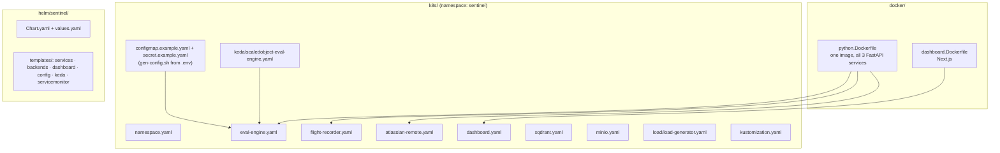
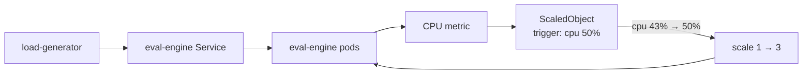
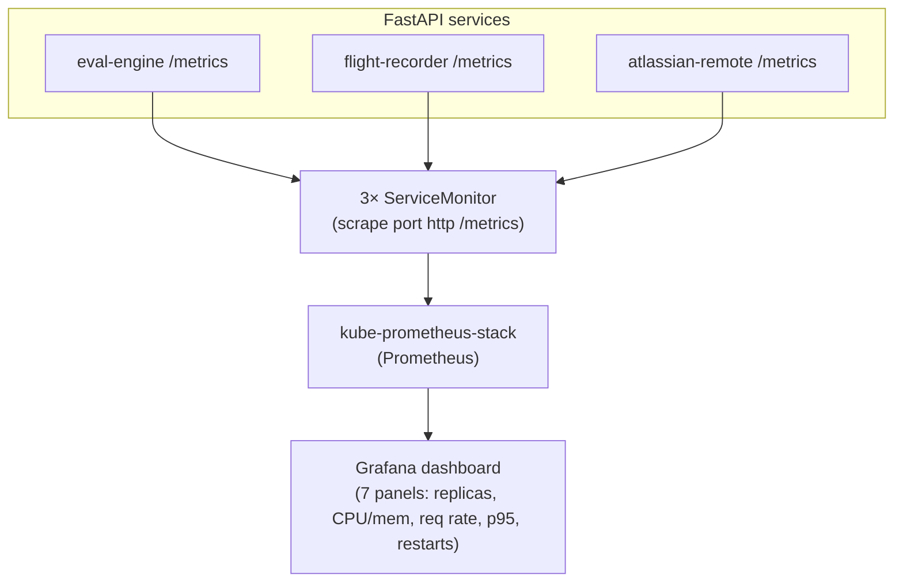
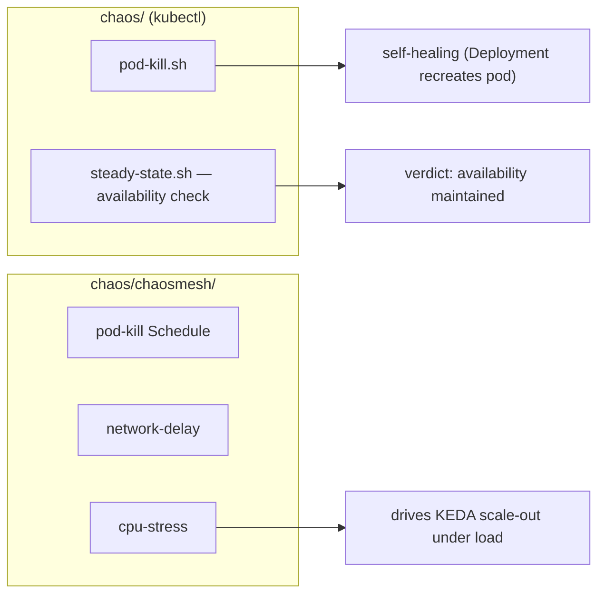

# deploy — Component Diagram (K8s · KEDA · Observability · Chaos)

> Kubernetes / Helm packaging of the platform with autoscaling, monitoring, and chaos tests.
> Each ` ```mermaid ` block pastes directly into [mermaid.live](https://mermaid.live).
> Back to the [system diagrams](../DIAGRAMS.md).

## Build & manifest layout



## KEDA autoscaling (CPU trigger)



## Observability stack



## Chaos engineering (resilience proof)


