# Sentinel — Submission Architecture Diagram

> Single-page architecture for the AINS 2026 final submission (brief §1.5.2:
> *system components · data flow · AI pipeline*). Rendered images live in
> [docs/diagrams/](diagrams/) (`architecture.svg` + `architecture.png`).
> The numbered edges ①–⑨ trace one incident end-to-end.

```mermaid
%%{init: {"theme":"base","themeVariables":{"fontFamily":"IBM Plex Sans, sans-serif","fontSize":"14px","lineColor":"#8896ab","primaryColor":"#ffffff","primaryBorderColor":"#94a3b8","primaryTextColor":"#0f172a","clusterBkg":"#FCFDFE","clusterBorder":"#D4DCE6"},"flowchart":{"curve":"basis","nodeSpacing":42,"rankSpacing":85,"padding":10,"useMaxWidth":true}}}%%
flowchart LR
    classDef atlas fill:#E7F0FE,stroke:#2F6FED,stroke-width:1.3px,color:#173A8A;
    classDef uc3 fill:#E2F6F0,stroke:#12A594,stroke-width:1.3px,color:#0E5B50;
    classDef uc2 fill:#FBF0DA,stroke:#D9952A,stroke-width:1.3px,color:#8A560C;
    classDef uc1 fill:#ECE9FB,stroke:#7A66E6,stroke-width:1.3px,color:#463A9C;
    classDef ai fill:#FBE7EE,stroke:#DB5E8C,stroke-width:1.3px,color:#99294F;
    classDef data fill:#EAEEF4,stroke:#74849A,stroke-width:1.3px,color:#2A3850;
    classDef ui fill:#F2FBF8,stroke:#0E9C8A,stroke-width:1.3px,color:#0E5B50;
    classDef edge fill:#FBF0DA,stroke:#D9952A,stroke-width:1.1px,color:#8A560C;

    %% ═════ ATLASSIAN CLOUD — trigger + native agent (UC3) ═════
    subgraph ATLAS["ATLASSIAN CLOUD"]
        direction TB
        JSM["Jira Service Management<br/><b>incident AO-123</b>"]
        AGENT["Rovo Agent — atlassian-agent<br/>Forge / TypeScript · 7 actions"]
        CONF["Confluence<br/>PIR pages · runbooks"]
        JSM --> AGENT
        AGENT -.->|RCA comment · PIR · link duplicate| CONF
    end

    GW(["Cloudflare Tunnel<br/>no open VM ports"]):::edge

    %% ═════ UC3 — GENERATION BACKEND ═════
    subgraph UC3["UC3 · GENERATION BACKEND"]
        direction TB
        REMOTE["atlassian-remote · :8080<br/>/analyze · /duplicates · /search · /embed"]
        RETR["vector_search<br/>SearchResult <i>+ attribution</i>"]
        RCAGEN["rca_generator<br/><b>RcaDraft</b> (structured)"]
        DUP["duplicate_resolver<br/><b>DuplicateVerdict</b>"]
        REMOTE --> RETR --> RCAGEN
        REMOTE --> DUP
    end

    %% ═════ AI PIPELINE + EVIDENCE ═════
    subgraph AIP["AI PIPELINE · WORKERS AI"]
        direction TB
        EMB["bge-base-en-v1.5<br/>768-dim embeddings"]
        LLM["llama-3.1-8b-instruct<br/>RCA + LLM judge"]
        GUARD["llama-guard-3-8b<br/>safety classifier"]
    end
    XQ[("xqdrant<br/>incidents · runbooks")]:::data

    %% ═════ UC2 — FLIGHT RECORDER ═════
    subgraph UC2["UC2 · FLIGHT RECORDER"]
        direction TB
        REC["flight-recorder · :8001<br/>record · <b>replay</b> · bisect · inject"]
        AUDIT["hash-chained HMAC audit<br/>tamper-evident · write-ahead"]
        REC --> AUDIT
    end

    %% ═════ UC1 — EVAL ENGINE ═════
    subgraph UC1["UC1 · EVAL ENGINE"]
        direction TB
        SAFE["eval-engine · :8000<br/>safety pre-filter"]
        CODE["code grader · 5 checks"]
        JUDGE["calibrated LLM judge ×2<br/>position-bias to uncertain"]
        ATTR["DAG failure attribution"]
        VERDICT["<b>EvalVerdict</b><br/>pass^k · self-eval · Cohen κ · drift"]
        SAFE --> CODE --> JUDGE --> ATTR --> VERDICT
    end

    %% ═════ DATA PLANE + UI ═════
    subgraph STORE["DATA PLANE · STATE & EVIDENCE"]
        direction TB
        MINIO[("MinIO<br/>cassettes")]
        D1[("Cloudflare D1<br/>manifests · trace · verdicts")]
        LF["Langfuse traces"]
    end
    DASH["DASHBOARD — Next.js :3001<br/>runs · trace · verdict · replay · reliability"]:::ui

    %% ───── numbered data-flow spine ─────
    AGENT ==>|"1 · POST /analyze"| GW ==> REMOTE
    REMOTE ==>|"2 · embed"| EMB
    RETR ==>|"3 · semantic search"| XQ
    RCAGEN ==>|"4 · structured RCA"| LLM
    REMOTE ==>|"5 · tape every call"| REC
    REC --> MINIO
    AUDIT --> D1
    REMOTE ==>|"6 · POST /evaluate"| SAFE
    UC1 -.loads cassette.-> MINIO
    JUDGE --> LLM
    SAFE --> GUARD
    VERDICT ==>|"7 · persist verdict"| D1
    VERDICT ==>|"8 · file Incident on fail / flag"| JSM
    REMOTE ==>|"9 · verdict + replay link"| AGENT

    UC3 -.->|traces| LF
    UC1 -.->|traces| LF
    DASH -.->|reads runs + verdicts| D1

    class JSM,AGENT,CONF atlas;
    class REMOTE,RETR,RCAGEN,DUP uc3;
    class REC,AUDIT uc2;
    class SAFE,CODE,JUDGE,ATTR,VERDICT uc1;
    class EMB,LLM,GUARD ai;
    class MINIO,D1,LF,XQ data;
```

**Why AI is the mechanism (brief §1.3):** remove the models and nothing works — semantic
retrieval (BGE), structured RCA + duplicate reasoning (Llama 3.1), an LLM-as-judge with
position-bias calibration, and a safety classifier are the system, not a feature on top.

**Explainability & audit (brief §1.3.4):** every verdict carries per-dimension scores,
per-step failure attribution, a confidence/self-critique, a tamper-evident hash-chained
audit trail, and a deterministic replay link.
