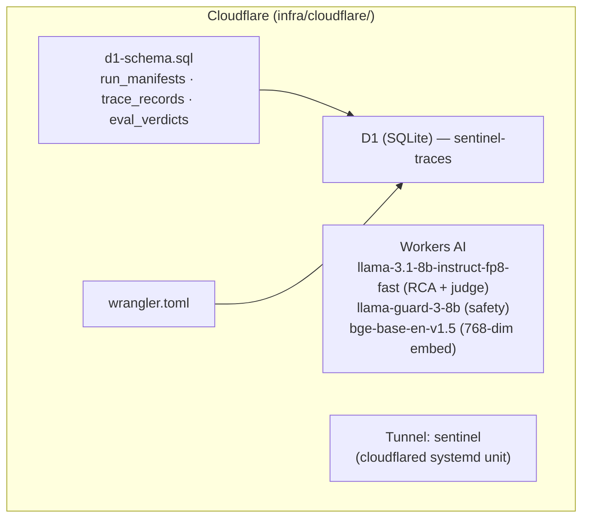
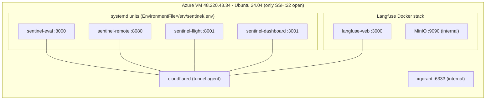
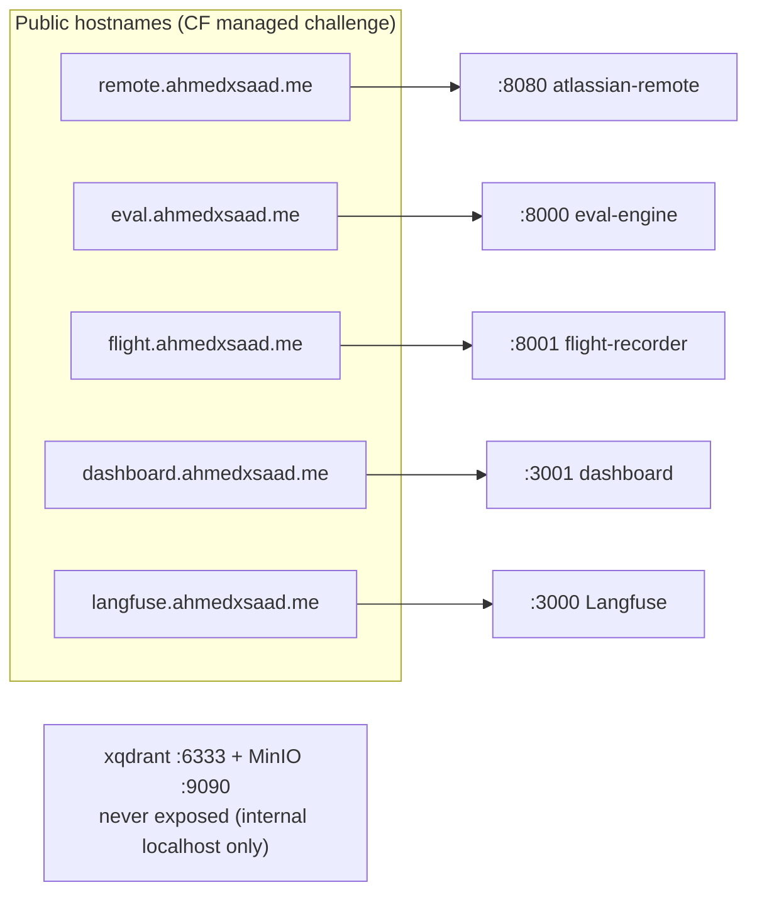
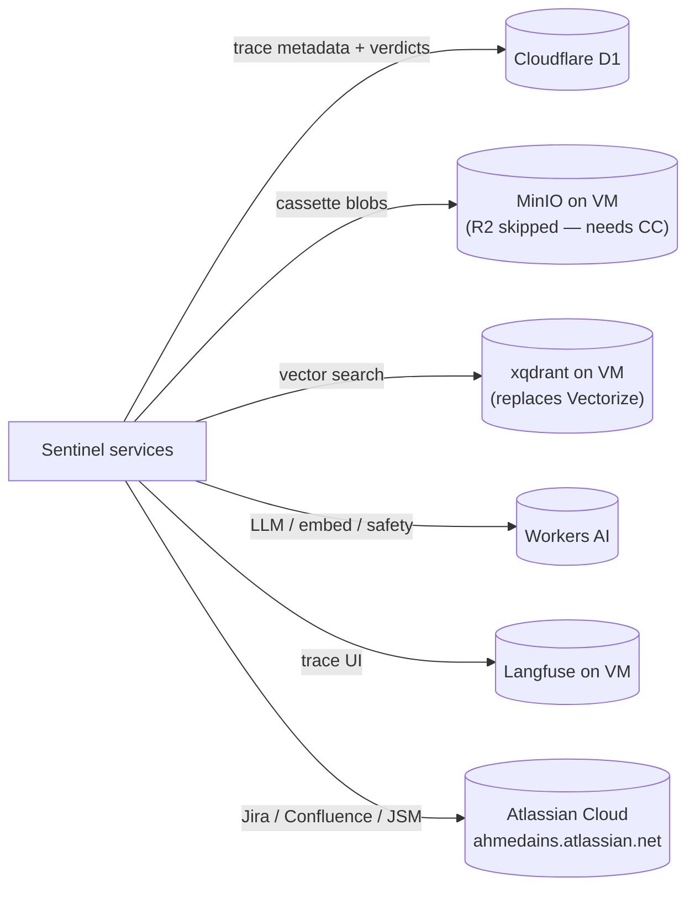

# infra — Component Diagram (Cloudflare · Azure)

> The deployed runtime: Azure VM, Cloudflare Tunnel + Workers AI + D1.
> Each ` ```mermaid ` block pastes directly into [mermaid.live](https://mermaid.live).
> Back to the [system diagrams](../DIAGRAMS.md).

## Cloudflare resources



## Azure VM topology (infra/azure/setup.sh)



## Ingress routing (Cloudflare Tunnel → internal ports)



## Where each store lives


