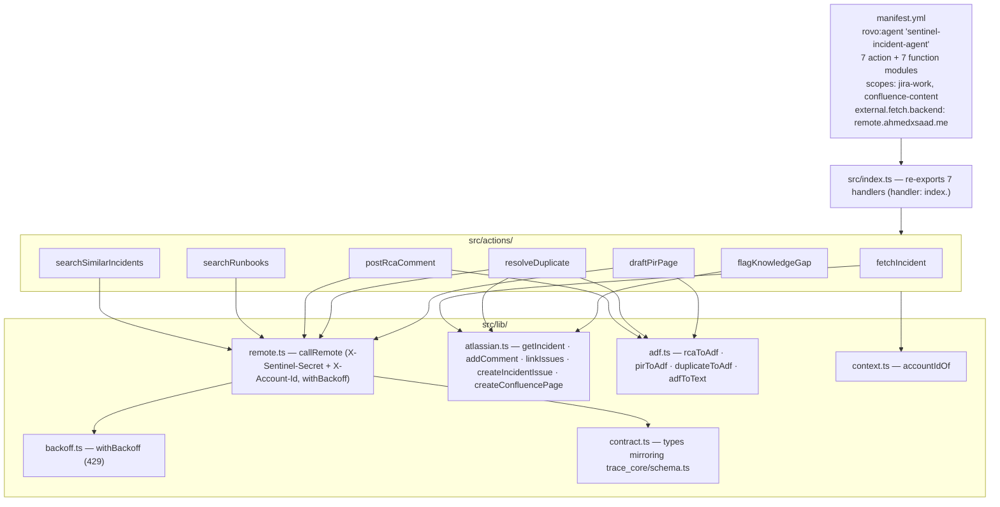
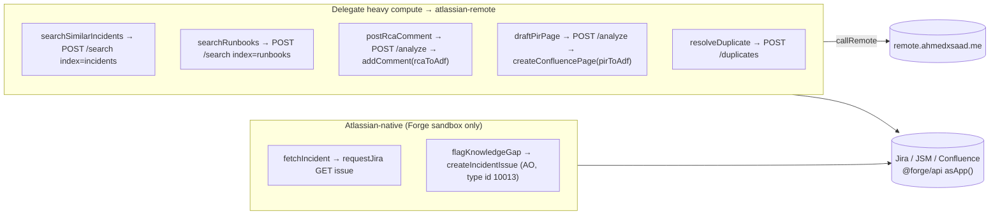
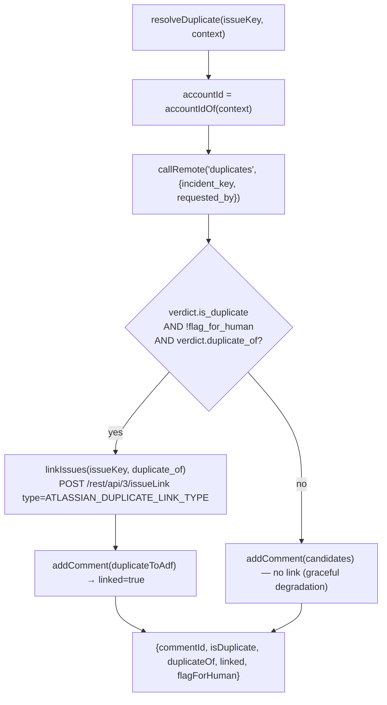
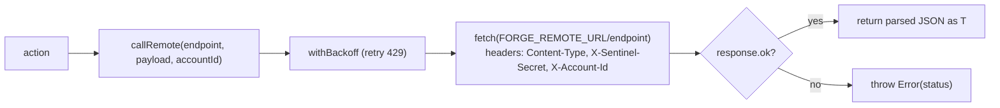

# atlassian-agent — Component Diagram (UC3 Forge)

> Code-accurate. Each ` ```mermaid ` block pastes directly into
> [mermaid.live](https://mermaid.live). Back to [system diagrams](../../DIAGRAMS.md).

## Module map (manifest → index → actions → lib)



## Action routing — native vs remote backend



## `resolveDuplicate` — the only writer of the Jira link graph



## `callRemote` request shape


