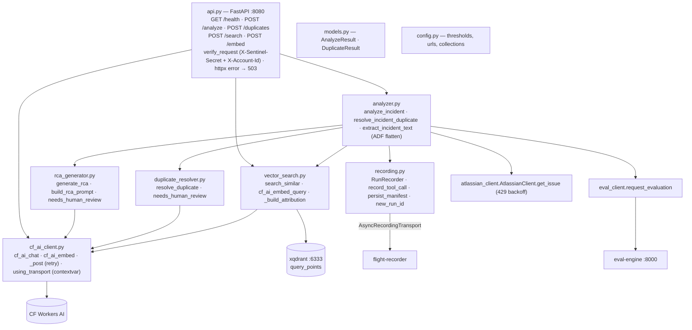
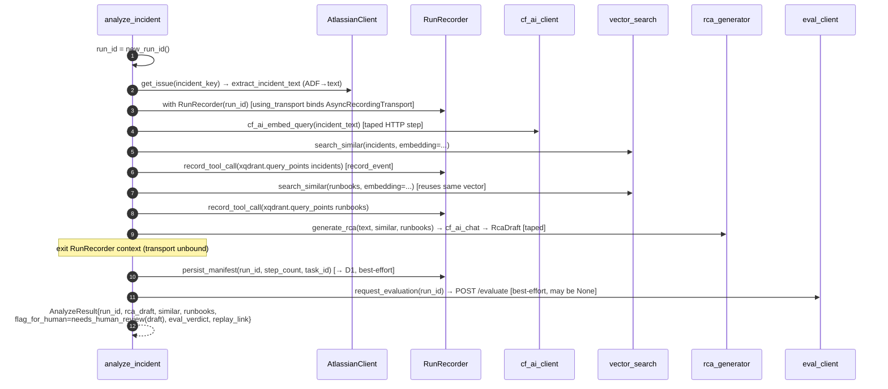
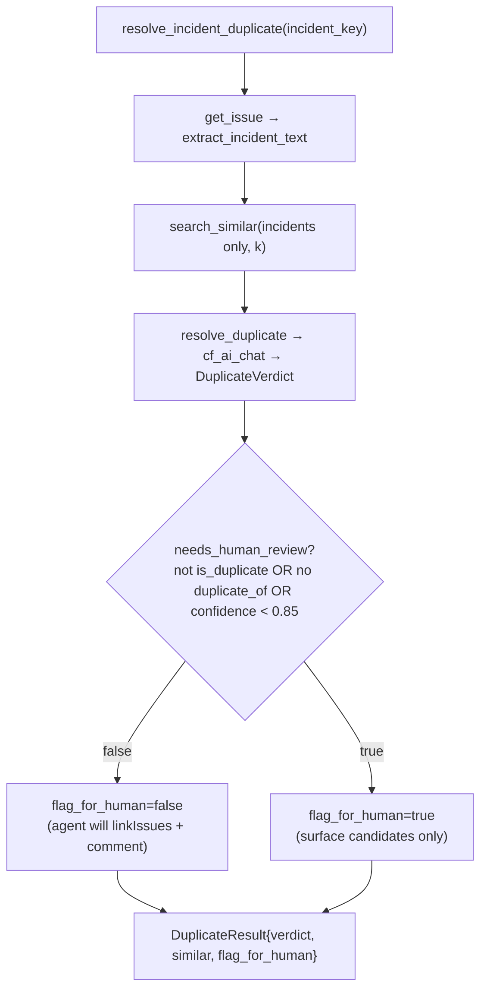
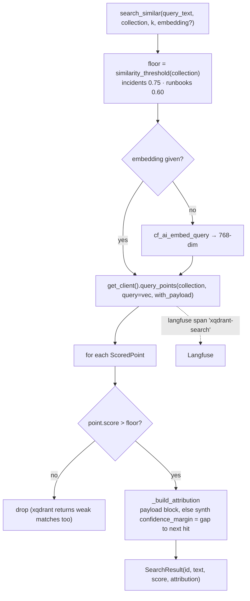
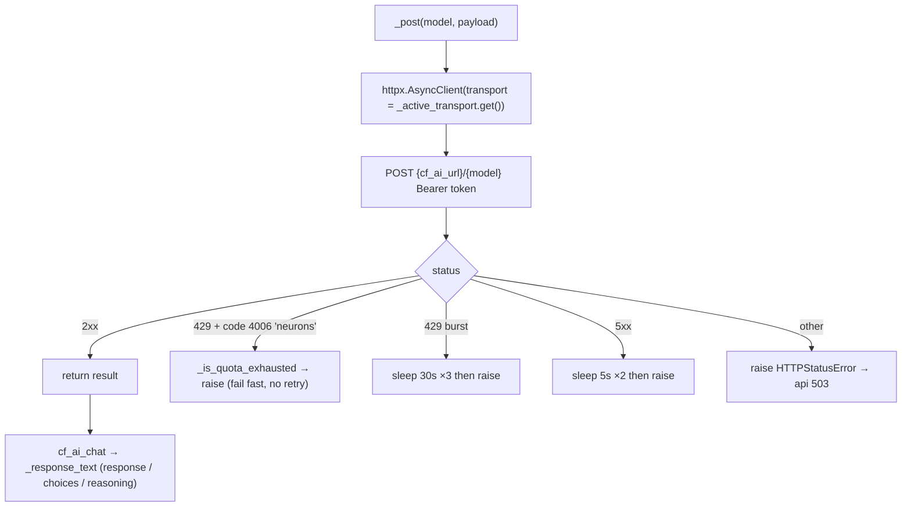

# atlassian-remote — Component Diagram (UC3 backend)

> Code-accurate. Each ` ```mermaid ` block pastes directly into
> [mermaid.live](https://mermaid.live). Back to [system diagrams](../../DIAGRAMS.md).

## Module map



## `/analyze` — the Phase 4 loop (`analyze_incident`)



## `/duplicates` — graceful-degradation gate



## `vector_search.search_similar` (xqdrant + always-on attribution)



## `cf_ai_client._post` — retry / quota / recording transport


