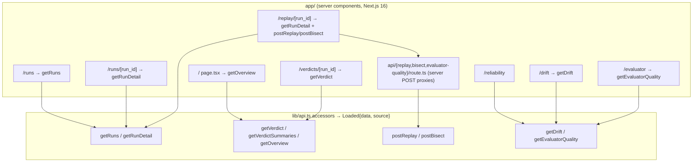
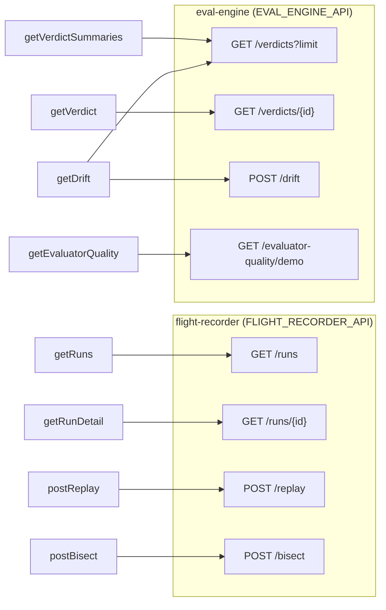
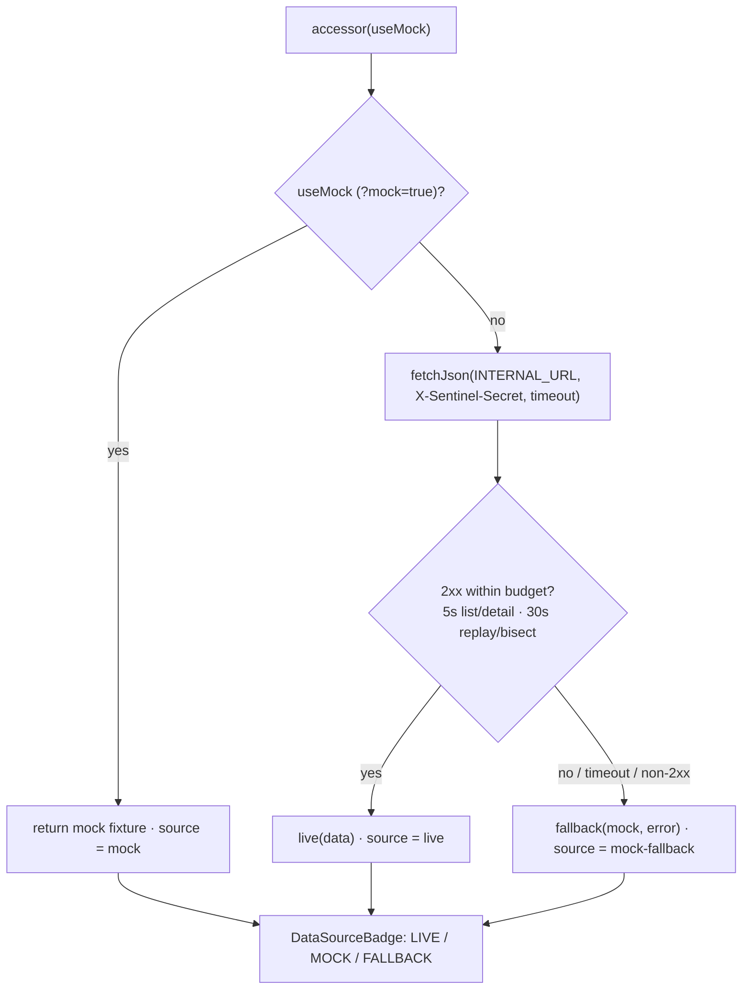
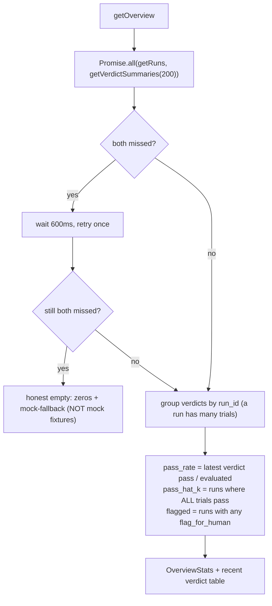
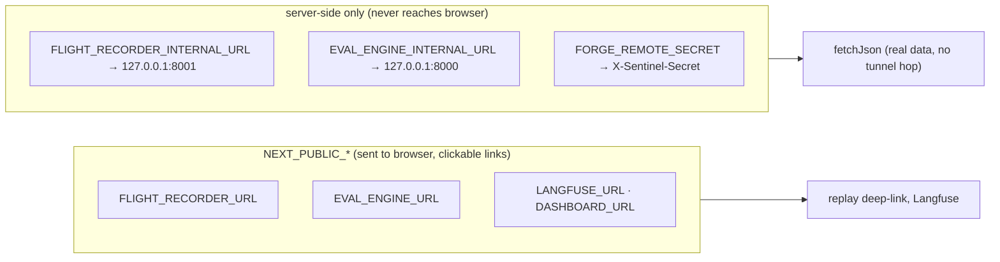
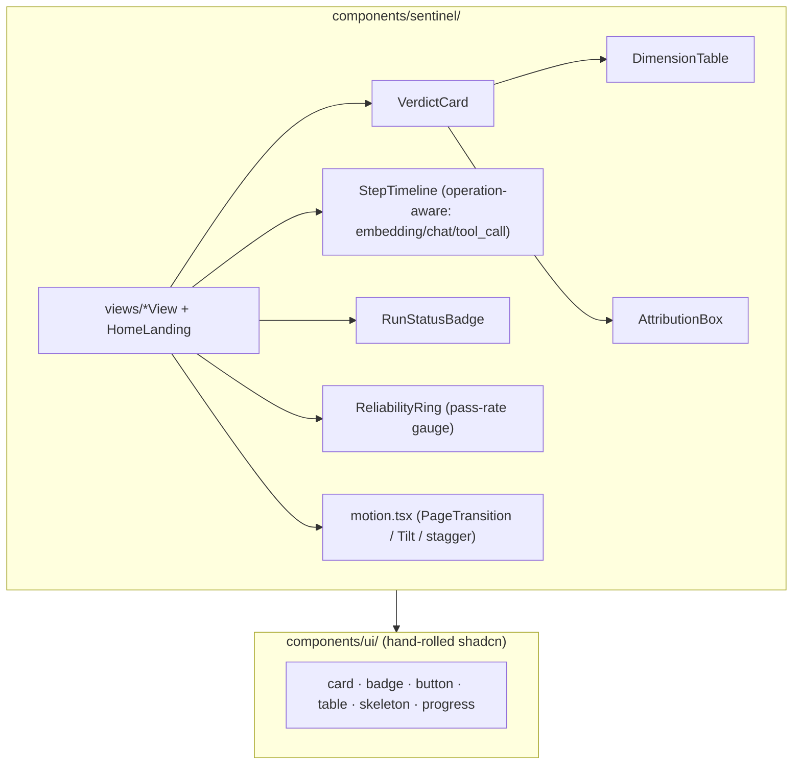

# dashboard — Component Diagram (UI)

> Code-accurate to `lib/api.ts` + the `app/` routes. Each ` ```mermaid ` block
> pastes directly into [mermaid.live](https://mermaid.live).
> Back to [system diagrams](../../DIAGRAMS.md).

## Routes & data accessors



## Each accessor → live service endpoint



## Server-side fetch with mock fallback (the demo safety net)



## `getOverview` — per-run aggregation (pass-rate / true pass^k)



## URL split (public links vs internal fetches)



## Components (`components/sentinel/`)


