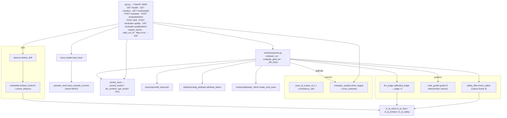
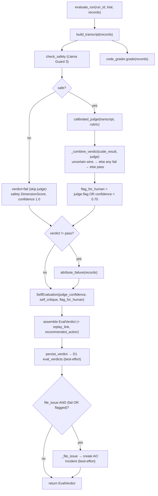
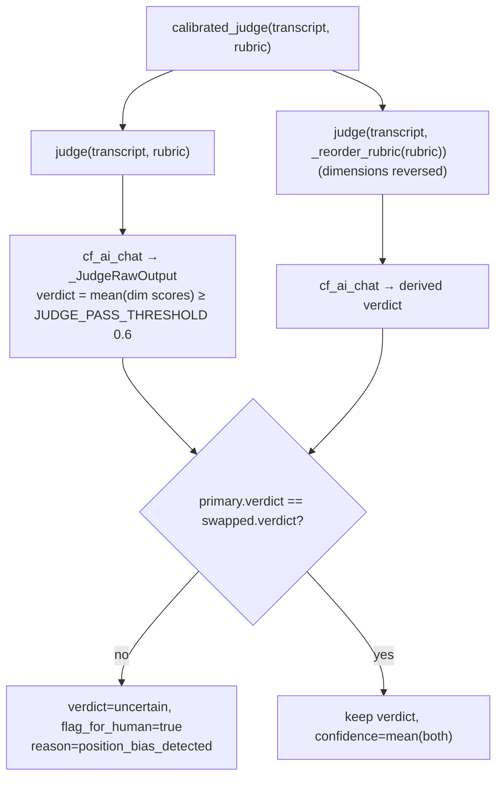
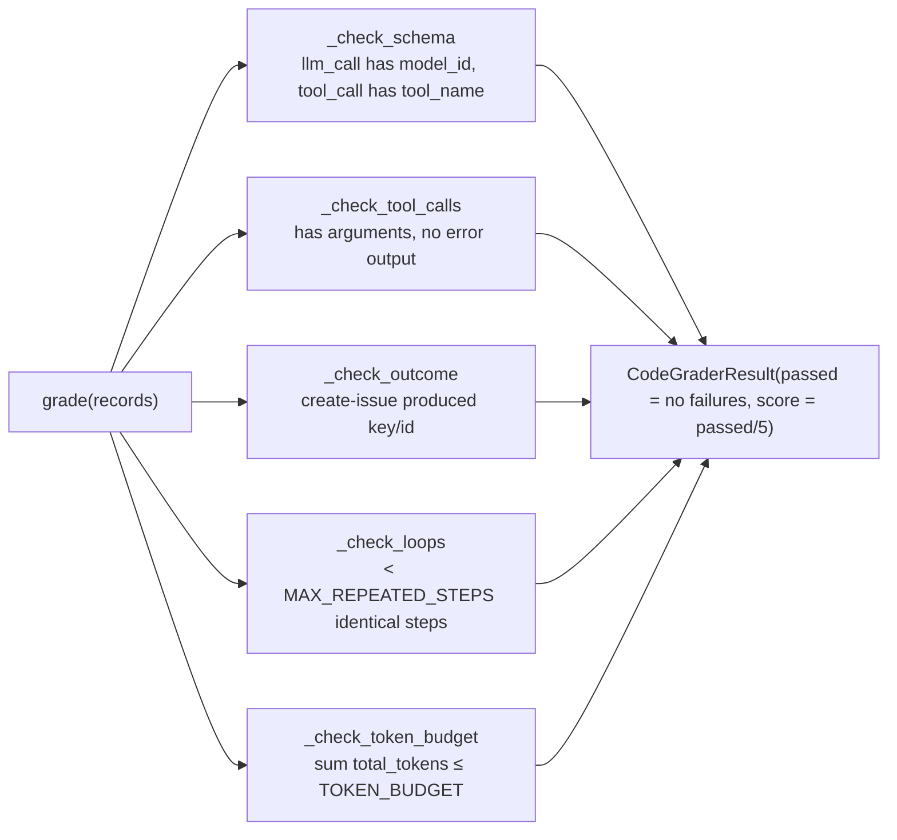
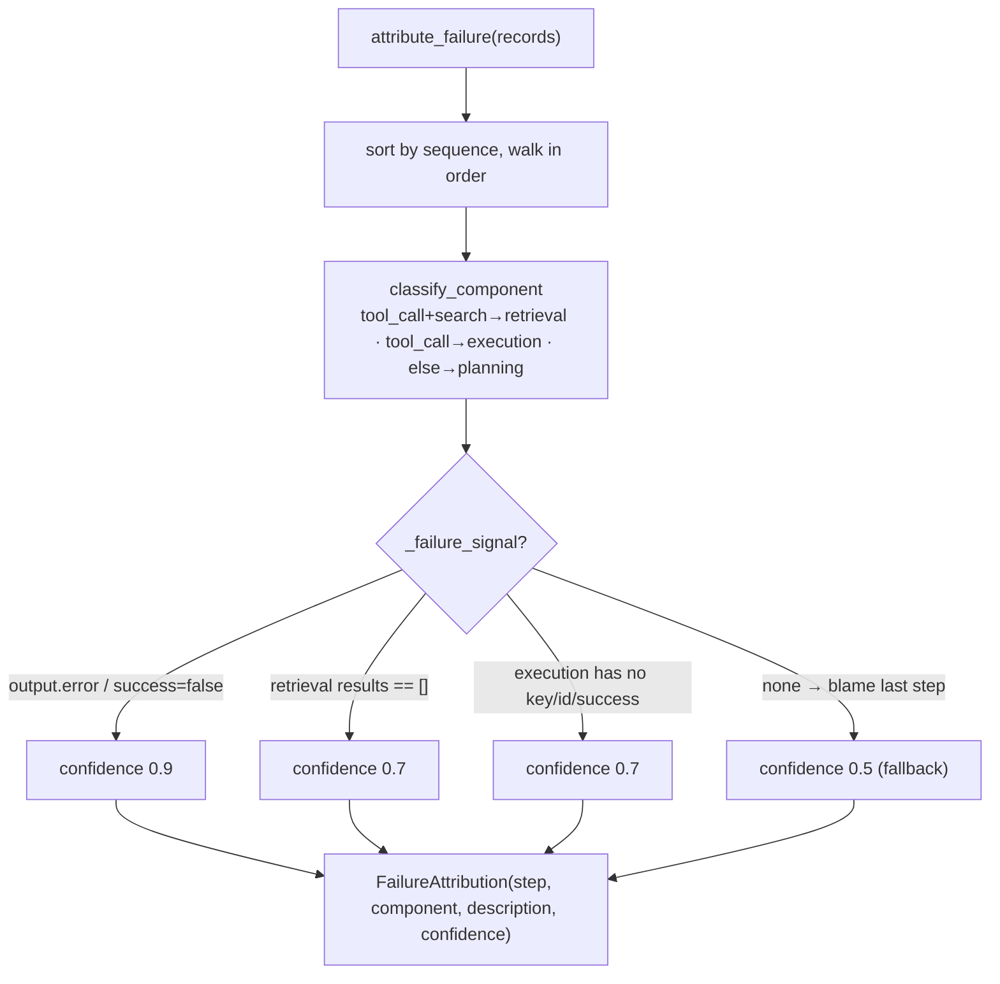
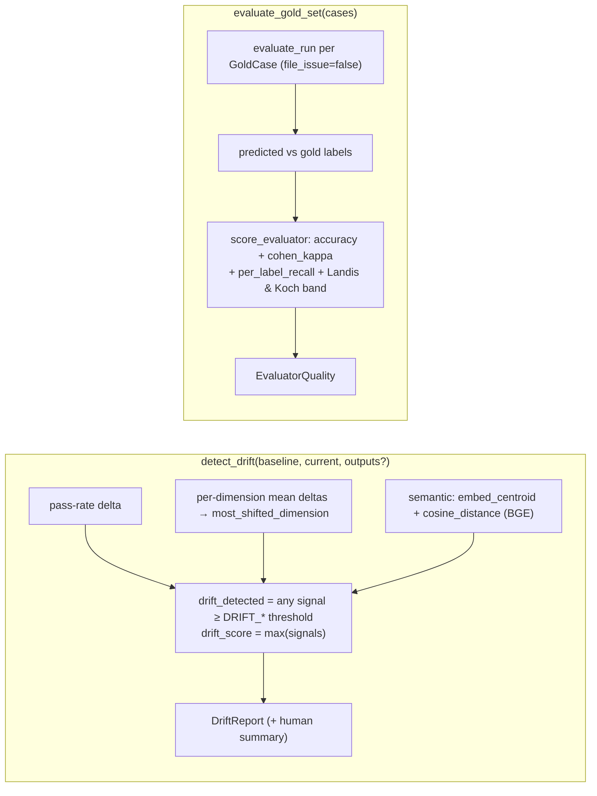
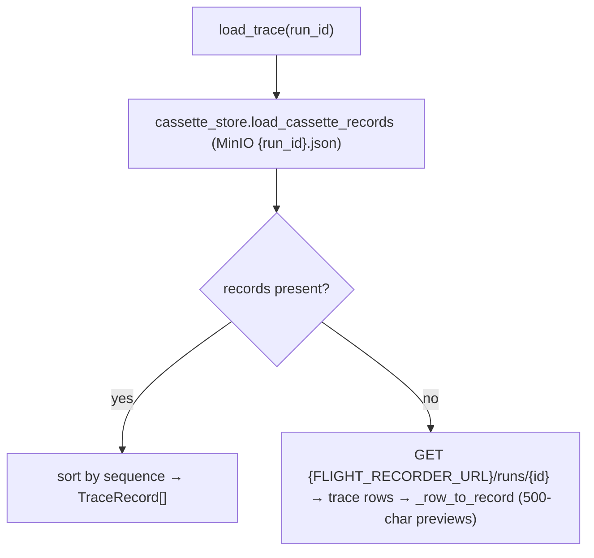

# eval-engine — Component Diagram (UC1)

> Code-accurate. Each ` ```mermaid ` block pastes directly into
> [mermaid.live](https://mermaid.live). Back to [system diagrams](../../DIAGRAMS.md).

## Module map



## `evaluate_run` pipeline (one trial → one EvalVerdict)



## Calibrated LLM judge (mandatory position-bias calibration)



## Code grader (5 deterministic checks; score = fraction passing)



## DAG failure attribution (VeriLA-style)



## Drift (`/drift`) & evaluator quality (`/evaluator-quality`)



## Trace loading (cassette first, D1 previews fallback)


