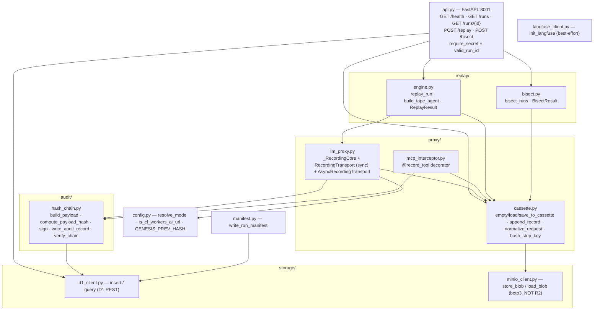
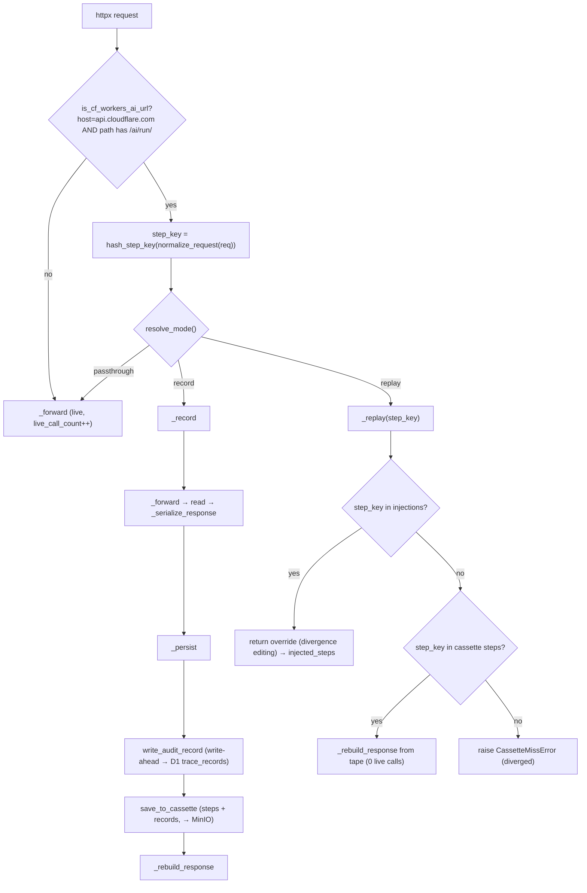
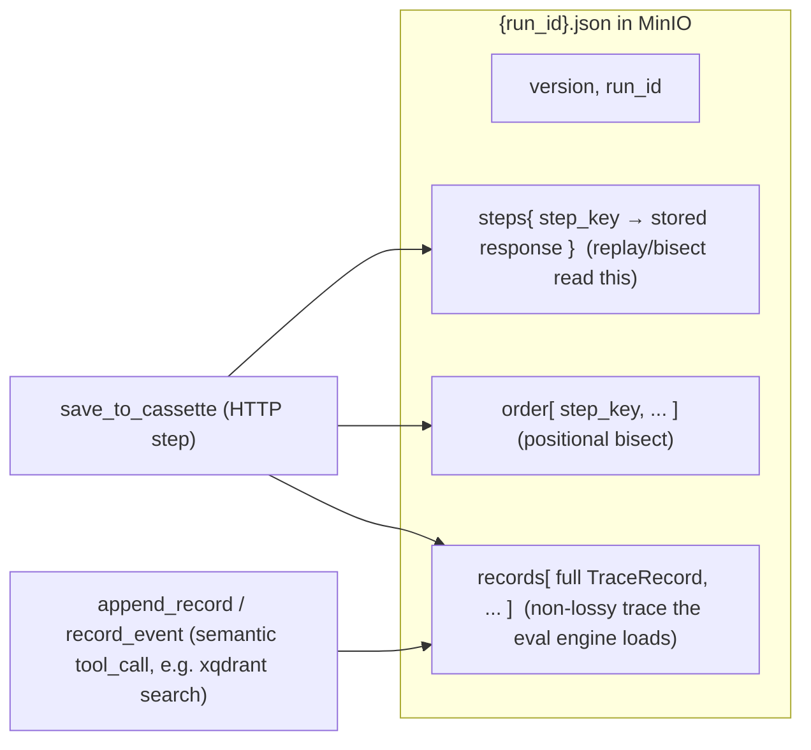
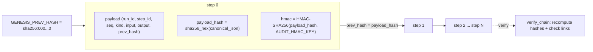
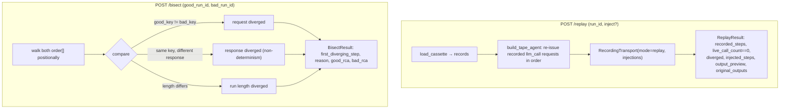
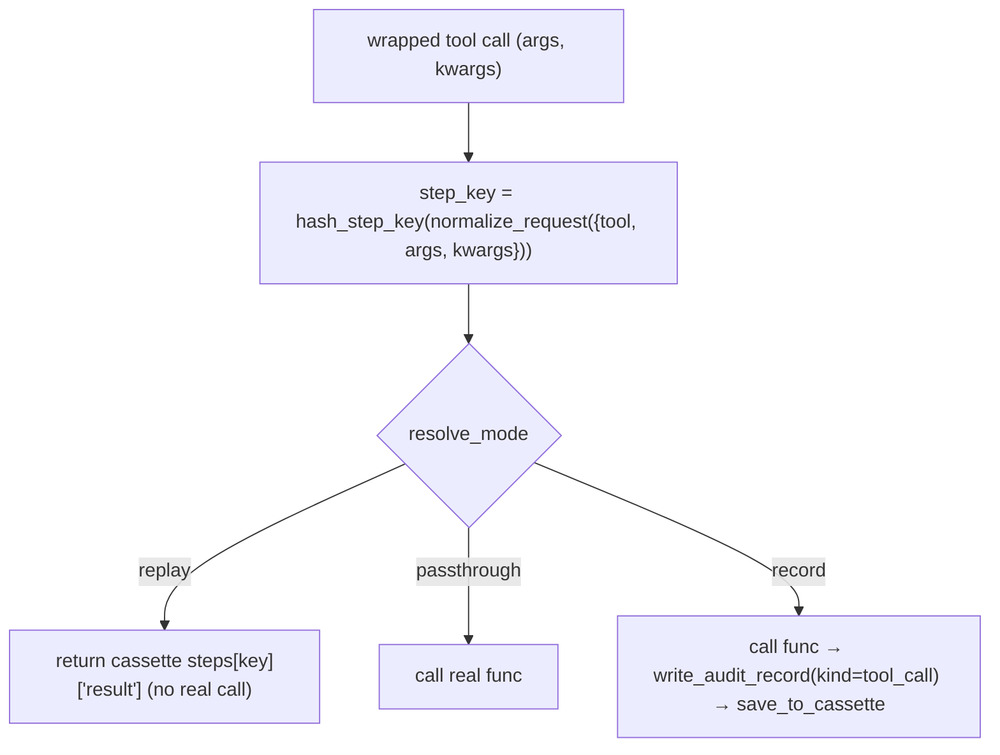

# flight-recorder — Component Diagram (UC2)

> Code-accurate. Each ` ```mermaid ` block pastes directly into
> [mermaid.live](https://mermaid.live). Back to [system diagrams](../../DIAGRAMS.md).

## Module map



## Transport request routing (`handle_request` / `handle_async_request`)



## Cassette structure & the two write paths



## Audit hash-chain (tamper-evident, write-ahead)



## Replay, inject & bisect (the API surface)



## `@record_tool` (function/MCP interception, separate from the HTTP proxy)


