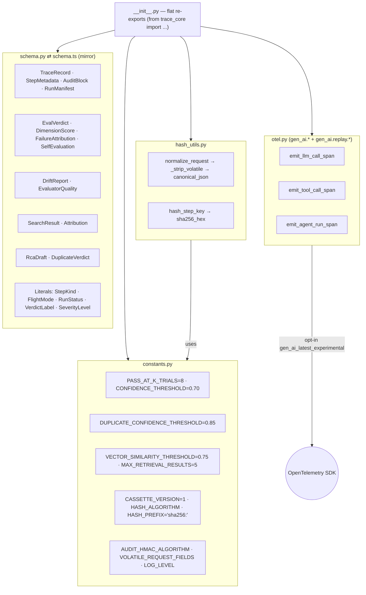
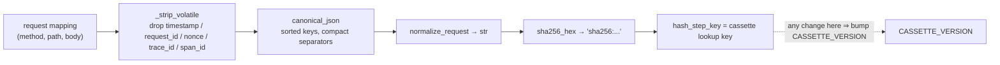
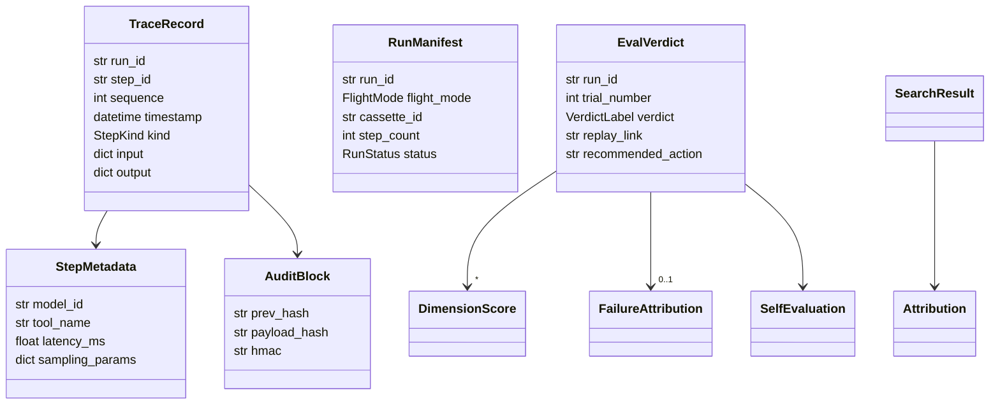
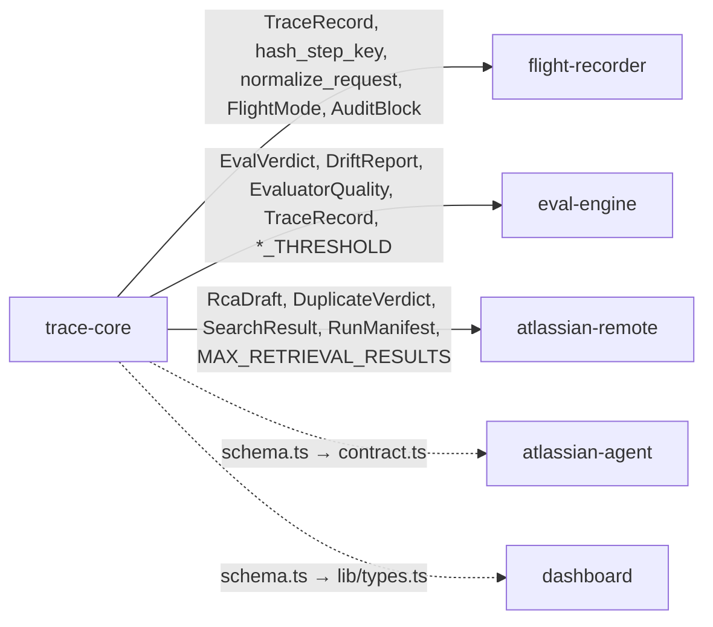

# trace-core — Component Diagram

> Code-accurate. Imported by everyone; imports nothing local. Each ` ```mermaid `
> block pastes directly into [mermaid.live](https://mermaid.live).
> Back to [system diagrams](../../DIAGRAMS.md).

## Module map (what `__init__.py` re-exports)



## Cassette-key hashing pipeline (the stability contract)



## Core schema relationships



## Who imports which symbols



**Rule:** edit `schema.py` → edit `schema.ts` in the same commit; edit the hashing/normalization → bump `CASSETTE_VERSION`.
